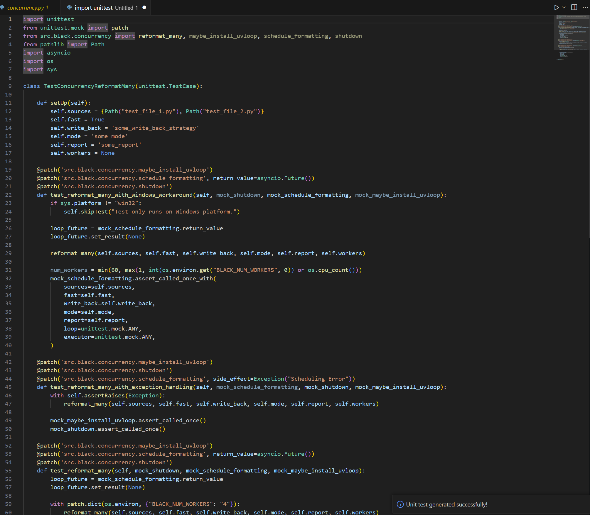

# LSPAI - Intelligent Unit Test Generation

<p align="center">
    <!-- <a href="https://arxiv.org/abs/2302.02261"> -->
    <a href="https://doi.org/10.1145/3696630.3728540">
    <a href="https://github.com/THU-WingTecher/DeepConstr/blob/main/LICENSE"></a>
    <a href="https://hub.docker.com/repository/docker/gwihwan/lspai/tags"></a>
</p>

LSPAI is a powerful VS Code extension that revolutionizes unit test creation through Language Server Protocol (LSP) integration. Generate high-quality unit tests automatically and in real-time for multiple programming languages.

## ✨ Key Features

- 🚀 Real-time unit test generation as you code
- 🌍 Multi-language support (Java, Go, Python)
- 🎯 Semantic-aware test generation using LSP

## 🎯 Project Status

| IDE      | Java | Python | Go  | C++ | TypeScript | Others |
|----------|------|--------|-----|-----|------------|--------|
| VS Code  | ✅   | ✅     | ✅  | ✅  | ✅         | ✅     |
| IntelliJ | 🚧   | 🚧     | 🚧  | 🚧  | 🚧         | 🚧     |

Legend:
- ✅ Fully Supported
- 🚧 In Development
- ❌ Not Yet Supported

## 🛠️ Setup Guide

### 1. Configure Language Servers

1. Install Required Language Servers from VS Code Marketplace: if you pull the docker image, these are already downloaded.
   - Java: Oracle Java Extension Pack ( identifier : oracle.oracle-java)
   - Python: Pylance and Python extension ( identifier : ms-python.vscode-pylance, ms-python.python)
   - Go: Go extension ( identifier : golang.go)

2. Language-Specific Setup: if you pull the docker image, these are already setted.
   
   **For Go:**
   Enable semantic tokenization in your VS Code settings.json:
   ```json
   {
     "gopls": {
       "ui.semanticTokens": true
     }
   }
   ```

3. [Optional] Project Compilation
   - While not required, compiling your project can improve error diagnosis and auto-fixing capabilities
   - Refer Experiment Setup

### 2. Configure LLM Settings

LSPAI supports multiple LLM providers. Configure your preferred option in VS Code settings:

1. Open VS Code Settings (Ctrl/Cmd + ,)
2. Configure LLM settings using one of these methods:

   **Option A: Through VS Code Settings UI**
   - Search for "LSPAI" settings
   - Configure your preferred model and API keys

   **Option B: Direct JSON Configuration**
   Add the following to your VS Code User Settings (settings.json):
   ```json
   {
     "LSPAI": {
       "provider": "deepseek",
       "model": "deepseek-chat",  // Choose: // gpt-4o-mini"; // llama3-70b // deepseek-chat
       "openaiApiKey": "your-api-key",    // Required for OpenAI
       "deepseekApiKey": "your-api-key",  // Required for Deepseek
       "localLLMUrl": "http://your-ollama-server:port",  // Required for Ollama
       "proxyUrl": "your-proxy-server"    // Optional: Configure if using a proxy
     }
   }
   ```
   The settings may be shaded, but don't worry, it is normal effect.

### 3. Generate Unit Tests

Now you are ready!! 

To generate unit tests with LSPAI:

1. Open your workspace in VS Code
2. Navigate to the function/method you want to test
3. Right-click within the function definition
4. Select "LSPAI::Generate Unit Test" from the context menu

5. Wait for the test generation to complete( it may take 30-40 seconds )

6. Checkout Generated example and deploy!



## 🛠️ Experiment Reproduction Guide
LSPAI is published under FSE-Industry'25 track (See [here](doc/FSE-Industry25-LSPAI.pdf) for papers). For detailed instructions on reproducing our experimental results, please refer to our [Experiments Documentation](./doc/ExperimentReproduction.md).

The experiments documentation includes:
- Dataset preparation steps
- Benchmark setup instructions
- Evaluation metrics and procedures
- Statistical analysis methods
- Hardware and software requirements

<!-- ## ⚙️ Extension Settings

Configure LSPAI through VS Code settings:

* `lspai.enable`: Enable/disable automatic test generation
* `lspai.coverage.threshold`: Set minimum coverage threshold
* `lspai.languages`: Configure supported languages -->

## 🔍 Known Issues

1. X Server Display Error
   ```bash
   [ERROR:ozone_platform_x11.cc(245)] Missing X server or $DISPLAY
   ```
   Solution: Run commands with `xvfb-run`

## 📝 Release Notes

### 1.0.0
- Initial release with support for Java, Go, and Python
- Real-time test generation capability
- Integrated coverage reporting

## 📚 Resources

- [Extension Guidelines](https://code.visualstudio.com/api/references/extension-guidelines)
- [VS Code Markdown Support](http://code.visualstudio.com/docs/languages/markdown)
- [Markdown Syntax Reference](https://help.github.com/articles/markdown-basics/)

## 🤝 Contributing

Contributions are welcome! Please feel free to submit a Pull Request.

---

**Happy Testing with LSPAI! 🎉**
